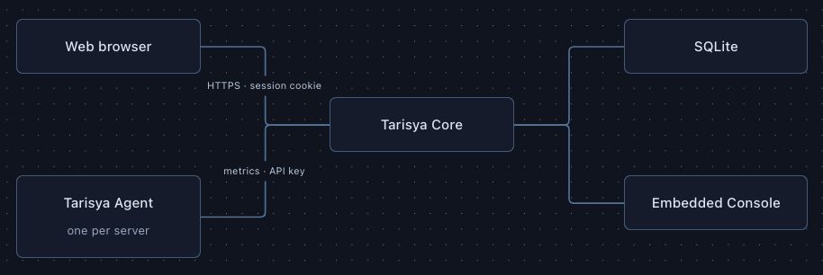

<div align="center">

# Tarisya

**A lightweight, self-hosted infrastructure monitoring platform.**

[Quick start](#quick-start) · [Install Core](#install-core) · [Add a server](#add-a-server) · [Production](#production-access) · [Development](#development)

</div>

> [!IMPORTANT]
> Tarisya is currently alpha software. APIs, configuration, and installation behavior may change before the first stable release.

## What is Tarisya?

Tarisya is a lightweight, self-hosted infrastructure monitoring platform for tracking the health of servers from a centralized web Console.

You run **Tarisya Core** on one machine and install **Tarisya Agent** on every server you want to monitor. Agents periodically send CPU, memory, disk, load average, uptime, and connectivity metrics to Core. Core stores the data in SQLite and serves the embedded web Console where you can view current status and metric history.

Tarisya is designed for individuals and small teams that want a simple monitoring system they can operate themselves without maintaining a separate database, frontend service, or large observability stack.

<p align="center">
  
</p>

## Features

- CPU, memory, disk, load average, and uptime monitoring
- Centralized monitoring for multiple servers
- Pending, online, offline, healthy, warning, and critical states
- Per-server Agent API keys with rotation and revocation
- HTTP-only session authentication and endpoint rate limiting
- SQLite retention, aggregation, and database size limits
- Built-in diagnostics, backup, restore, and database checks
- Embedded React Console—no separate frontend service required
- Native Linux/systemd, macOS/launchd, and Docker deployment
- Intel and Apple Silicon macOS support from Monterey onward

## Components

| Component   | Runs on                 | Responsibility                                                                     |
| ----------- | ----------------------- | ---------------------------------------------------------------------------------- |
| **Core**    | Monitoring host         | Receives metrics, stores data, authenticates users, and serves the API and Console |
| **Console** | Your browser            | Displays servers, current health, and metric history; compiled into Core           |
| **Agent**   | Every monitored machine | Collects system metrics and sends them to Core every 15 seconds by default         |

## Quick start

The fastest local evaluation uses Docker Compose:

```bash
git clone https://github.com/mhmdnurf/tarisya.git
cd tarisya
docker compose up -d --build
```

Open [http://localhost:8081](http://localhost:8081) and sign in:

```text
Email:    dev@tarisya.local
Password: development-password
```

The Compose configuration creates development credentials and a demo server. Never use these credentials for a public installation.

Check that Core is healthy:

```bash
curl http://localhost:8081/health
```

Expected response:

```json
{ "status": "ok" }
```

## Install Core

The native installer supports Linux distributions using `systemd`. It installs the administration CLI, Core, and optionally a local Agent that monitors the Core host itself.

Requirements:

- Linux with `systemd`
- `root` or `sudo` access
- `curl`
- AMD64 or ARM64 CPU

Install the current alpha release:

```bash
curl -fsSL https://tarisya.nurfatkhur.com/install.sh |
  sudo TARISYA_VERSION=v0.1.1-alpha.1 bash
```

The installer asks whether to install a local Agent and prompts for the first administrator account. After installation, verify it:

```bash
tarisya doctor
sudo systemctl status tarisya-core
curl http://127.0.0.1:8081/health
```

The native installation uses these locations:

| Purpose             | Location                      |
| ------------------- | ----------------------------- |
| Core configuration  | `/etc/tarisya/core.env`       |
| Agent configuration | `/etc/tarisya/agent.env`      |
| SQLite database     | `/var/lib/tarisya/tarisya.db` |
| Backups             | `/var/backups/tarisya`        |
| Core service        | `tarisya-core.service`        |
| Agent service       | `tarisya-agent.service`       |

### macOS 12 Monterey or newer

The macOS installer supports Intel and Apple Silicon. It installs Core as a
system LaunchDaemon running under the macOS user who invoked `sudo`, and can
optionally install a local Agent.

> [!NOTE]
> Replace `vX.Y.Z` with a release that includes the macOS installer and launchd
> assets. Releases created before this feature cannot be installed this way.

```bash
curl -fsSL https://tarisya.nurfatkhur.com/install-macos.sh |
  sudo TARISYA_VERSION=vX.Y.Z bash
```

The macOS installation uses:

| Purpose                | Location                                  |
| ---------------------- | ----------------------------------------- |
| Configuration and data | `/Library/Application Support/Tarisya`    |
| Logs                   | `/Library/Logs/Tarisya`                    |
| Core service           | `com.tarisya.core`                         |
| Agent service          | `com.tarisya.agent`                        |

Verify Core and open the local Console:

```bash
curl http://127.0.0.1:8081/health
sudo launchctl print system/com.tarisya.core
open http://localhost:8081
```

Install only the Agent on another Mac:

```bash
curl -fsSL https://tarisya.nurfatkhur.com/install-agent-macos.sh |
  sudo TARISYA_VERSION=vX.Y.Z \
    TARISYA_CORE_URL=https://monitor.example.com \
    TARISYA_SERVER_ID=srv_xxxxxxxx \
    TARISYA_API_KEY=tar_xxxxxxxx \
    bash
```

Tarisya supports macOS 12 Monterey or newer. Catalina and Big Sur are not
supported by the current release toolchain.

### Open the Console

The Console is served by Core at `/`; it is not a separate process:

```text
/           Embedded React Console
/api/v1/*   Core REST API
/health     Core health endpoint
```

For private access without a domain, create an SSH tunnel **from your computer**:

```bash
ssh -N -L 8081:127.0.0.1:8081 YOUR_USERNAME@YOUR_SERVER_IP
```

Keep the SSH session open and visit [http://localhost:8081](http://localhost:8081).

> [!WARNING]
> The native installer currently configures Core to listen on port `8081`. Do not expose unencrypted port `8081` directly to the public internet. Restrict it with a firewall, bind it to localhost, use a private network, or place an HTTPS reverse proxy in front of it.

## Add a server

1. Open the Console and sign in.
2. Go to **Servers** and create a server.
3. Copy the generated `server_id`, `api_key`, and `core_url`.
4. Install the Agent on that server.
5. Wait for its first metric sample; it should change from `pending` to `online`.

Each machine must have its own server ID and API key. The API key is shown only when the server is created or its key is rotated.

### Install a remote Agent

Core must be reachable from the monitored server through HTTPS, a private network, or a secure tunnel. On a Linux/systemd server, run:

```bash
curl -fsSL https://tarisya.nurfatkhur.com/install-agent.sh |
  sudo TARISYA_VERSION=v0.1.1-alpha.1 \
    TARISYA_CORE_URL=https://monitor.example.com \
    TARISYA_SERVER_ID=srv_xxxxxxxx \
    TARISYA_API_KEY=tar_xxxxxxxx \
    bash
```

Verify the Agent:

```bash
sudo systemctl status tarisya-agent
sudo journalctl -u tarisya-agent -n 50 --no-pager
```

Successful delivery produces a `metrics sent` log entry. The default collection interval is 15 seconds.

## Production access

Use a domain and HTTPS for an internet-facing deployment. Keep Core on localhost and place Caddy, Nginx, or another trusted reverse proxy in front of it.

Example Caddy configuration:

```caddyfile
monitor.example.com {
    reverse_proxy 127.0.0.1:8081
}
```

Update `/etc/tarisya/core.env`:

```env
TARISYA_CORE_ADDRESS=127.0.0.1:8081
TARISYA_PUBLIC_CORE_URL=https://monitor.example.com
TARISYA_ALLOWED_ORIGINS=https://monitor.example.com
TARISYA_COOKIE_SECURE=true
```

Restart Core after changing its configuration:

```bash
sudo systemctl restart tarisya-core
sudo systemctl status tarisya-core
```

Allow inbound TCP ports `80` and `443` for the reverse proxy, keep SSH available, and do not publicly open port `8081`.

Remote Agents can then use:

```env
TARISYA_CORE_URL=https://monitor.example.com
```

If you do not have a domain, use an SSH tunnel for browser access and a private network such as WireGuard or Tailscale for remote Agents.

## Docker

```bash
git clone https://github.com/mhmdnurf/tarisya.git
cd tarisya
cp .env.example .env
docker compose up -d --build
```

Before exposing Docker publicly:

- replace `TARISYA_JWT_SECRET` with a long random value;
- replace all bootstrap credentials and API keys;
- set the correct public Core URL and allowed origin;
- enable secure cookies behind HTTPS;
- preserve the `tarisya_data` volume; and
- restrict direct access to port `8081`.

Follow logs and stop the stack with:

```bash
docker compose logs -f core
docker compose down
```

Do not add `-v` to `docker compose down` unless you intentionally want to delete the database volume.

## Configuration

Common Core settings:

| Variable                     | Default                   | Description                                          |
| ---------------------------- | ------------------------- | ---------------------------------------------------- |
| `TARISYA_CORE_ADDRESS`       | `:8081`                   | Core listen address                                  |
| `TARISYA_PUBLIC_CORE_URL`    | `http://localhost:8081`   | URL placed in generated Agent configuration          |
| `TARISYA_DATABASE_URL`       | required                  | SQLite connection URL                                |
| `TARISYA_JWT_SECRET`         | required                  | Session-signing secret of at least 32 characters     |
| `TARISYA_ALLOWED_ORIGINS`    | local development origins | Comma-separated browser origins allowed by CORS      |
| `TARISYA_COOKIE_SECURE`      | `false`                   | Send the session cookie only over HTTPS              |
| `TARISYA_OFFLINE_THRESHOLD`  | `90s`                     | Time without metrics before a server becomes offline |
| `TARISYA_WARNING_THRESHOLD`  | `80`                      | Resource percentage that produces warning health     |
| `TARISYA_CRITICAL_THRESHOLD` | `90`                      | Resource percentage that produces critical health    |

Common Agent settings:

| Variable               | Default                 | Description                              |
| ---------------------- | ----------------------- | ---------------------------------------- |
| `TARISYA_CORE_URL`     | `http://localhost:8081` | Reachable Core base URL                  |
| `TARISYA_SERVER_ID`    | required                | Server identifier created by Core        |
| `TARISYA_API_KEY`      | required                | Per-server bearer credential             |
| `TARISYA_INTERVAL`     | `15s`                   | Metric collection interval               |
| `TARISYA_HTTP_TIMEOUT` | `10s`                   | Core request timeout                     |
| `TARISYA_DISK_PATH`    | `/`                     | Filesystem path monitored for disk usage |

See [.env.example](.env.example) for development defaults and additional retention, database-size, and rate-limit settings.

## Administration

```bash
# Overall readiness
tarisya doctor

# Database integrity and migrations
sudo tarisya database check \
  --database file:/var/lib/tarisya/tarisya.db

# Manual backup
sudo tarisya backup \
  --database file:/var/lib/tarisya/tarisya.db \
  --output /var/backups/tarisya/manual.db

# Service logs
sudo journalctl -u tarisya-core -f
sudo journalctl -u tarisya-agent -f
```

## API

Core exposes a JSON REST API under `/api/v1`. Browser endpoints authenticate with the HTTP-only `tarisya_session` cookie. Agents authenticate to `/api/v1/metrics` with a per-server Bearer API key.

Log in and store the session cookie:

```bash
curl -i -c cookies.txt -X POST http://localhost:8081/api/v1/auth/login \
  -H "Content-Type: application/json" \
  -d '{"email":"jane@example.com","password":"correct-horse-battery-staple"}'
```

Create and list servers:

```bash
curl -s -b cookies.txt -X POST http://localhost:8081/api/v1/servers \
  -H "Content-Type: application/json" \
  -d '{"name":"prod-web-1"}'

curl -s -b cookies.txt http://localhost:8081/api/v1/servers
```

Read current and historical metrics:

```bash
curl -s -b cookies.txt \
  http://localhost:8081/api/v1/servers/srv_xxxxxxxx/latest-metrics

curl -s -b cookies.txt \
  'http://localhost:8081/api/v1/servers/srv_xxxxxxxx/metrics?range=24h'
```

## Development

Requirements:

- Go 1.24 or later
- Node.js 24 or later
- pnpm 10
- Git

```bash
git clone https://github.com/mhmdnurf/tarisya.git
cd tarisya
cp .env.example .env
./scripts/build.sh
```

The build script installs Console dependencies, lints and builds the Console, stages its assets for `go:embed`, runs all Go tests, and creates:

```text
bin/tarisya-core
bin/tarisya-agent
```

For development, run each command in a separate terminal:

```bash
# Terminal 1: Core and embedded production Console
go run ./cmd/core
```

```bash
# Terminal 2: Console development server with hot reload
cd console
pnpm install --frozen-lockfile
pnpm dev
```

```bash
# Terminal 3: Agent
go run ./cmd/agent
```

Vite forwards `/api` requests to Core at `http://localhost:8081` during development.

Run checks independently:

```bash
go test ./...

cd console
pnpm lint
pnpm build
```

## Troubleshooting

```bash
tarisya doctor
curl http://127.0.0.1:8081/health
sudo systemctl status tarisya-core
sudo journalctl -u tarisya-core -n 100 --no-pager
sudo systemctl status tarisya-agent
sudo journalctl -u tarisya-agent -n 100 --no-pager
```

Common problems:

- **Console does not open:** confirm Core is running and that port `8081` is reachable locally; use an SSH tunnel for private remote access.
- **Login does not persist:** use HTTPS with `TARISYA_COOKIE_SECURE=true`, or plain HTTP with it set to `false` for local development only.
- **Server remains pending:** inspect Agent logs and confirm its Core URL, server ID, and API key.
- **Agent receives `401 Unauthorized`:** rotate the server API key in the Console and update the Agent configuration.
- **Agent cannot connect:** verify DNS, firewall rules, TLS, and that the configured Core URL is reachable from the Agent host.

## Contributing

Contributions are welcome. Read [CONTRIBUTING.md](CONTRIBUTING.md), create a focused branch, and run the checks above before opening a pull request.

Use [GitHub Issues](https://github.com/mhmdnurf/tarisya/issues) for bug reports and feature proposals.

## Security

Do not report security vulnerabilities in a public issue. Use [GitHub's private vulnerability reporting](https://github.com/mhmdnurf/tarisya/security/advisories/new).

## License

Tarisya is available under the [MIT License](LICENSE).
